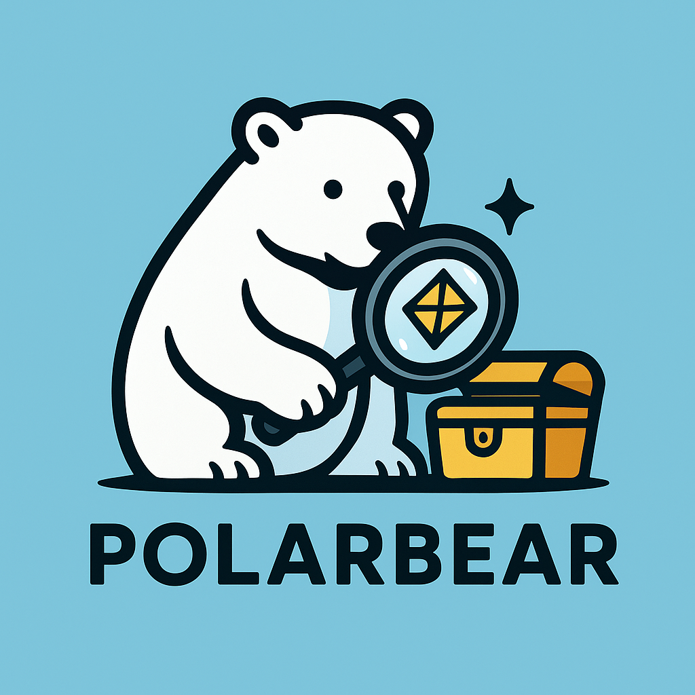

<div align="center">
  
  <h1>PolarBear 🐻‍❄️</h1>
  <p><strong>The Open-Source Hybrid Search Engine for SMEs</strong></p>
  
  [](https://opensource.org/licenses/MIT)
  [](https://www.python.org/)
  [](https://nextjs.org/)
  [](https://www.docker.com/)

  <p>
    <a href="#-features">Features</a> •
    <a href="#-getting-started">Getting Started</a> •
    <a href="#-documentation">Documentation</a> •
    <a href="#-contributing">Contributing</a>
  </p>
</div>

---

## 🌟 Introduction

**PolarBear** is a powerful, no-code, AI-enhanced search engine designed specifically for Small and Medium-sized Enterprises (SMEs). It democratizes access to advanced search technology, allowing business owners to create a professional search experience for their products, services, or inventory in minutes—completely free and open source.

Unlike complex enterprise solutions, PolarBear focuses on simplicity without compromising on power. It combines **Keyword Search** (Meilisearch) and **Semantic Vector Search** (FAISS) to deliver results that are both accurate and contextually relevant.

## 🚀 Features

- **🔍 Hybrid Search**: seamlessly blends keyword matching (BM25) with AI-powered semantic search (Embeddings) for superior result relevance.
- **⚡ No-Code Ingestion**: Upload your data via CSV, Excel, or Google Sheets. No coding required.
- **🧠 AI-Ready**: Built-in vectorization pipeline using state-of-the-art embedding models.
- **📊 Insights Dashboard**: Track user behavior, top queries, zero-result searches, and conversion metrics.
- **🛍️ Product Management**: Built-in catalog management to edit products and upload images directly.
- **☁️ Cloud-Native**: Dockerized for easy deployment on Google Cloud Run, AWS, or your own server.
- **🔓 Open Source**: 100% free to use, modify, and distribute.

## 🛠️ Tech Stack

| Component | Technology | Description |
|-----------|------------|-------------|
| **Frontend** | Next.js (React) | Modern, responsive admin and search UI. |
| **Backend** | FastAPI (Python) | High-performance API for ingestion and search. |
| **Search** | Meilisearch | Lightning-fast keyword search engine. |
| **Vector DB** | FAISS | Efficient similarity search for embeddings. |
| **Infrastructure** | Docker | Containerized for consistent deployment. |

## 🚀 Getting Started

### Prerequisites
- **Node.js** 18+
- **Python** 3.11+
- **Docker** & **Docker Compose**

### Quick Start

1.  **Clone the Repository**
    ```bash
    git clone https://github.com/dukesky/PolarBear.git
    cd PolarBear
    ```

2.  **Start Infrastructure**
    ```bash
    cd infrastructure
    docker-compose up -d
    ```

3.  **Start Backend**
    ```bash
    cd backend
    poetry install
    poetry run uvicorn app.main:app --reload --port 8000
    ```

4.  **Start Frontend**
    ```bash
    cd frontend
    npm install
    npm run dev
    ```

5.  **Experience PolarBear**
    - **Upload Data**: Go to `http://localhost:3000/upload` and upload a CSV (e.g., `sample_products.csv`).
    - **Search**: Visit `http://localhost:3000/search` to try the hybrid search.
    - **Insights**: Check `http://localhost:3000/insights` for analytics and product management.

## 📚 Documentation

Detailed walkthroughs for each development phase:

- [**Phase 1: Setup & MVP Core**](docs/phase1/walkthrough_phase1.md) - Infrastructure and basic search.
- [**Phase 2: Ingestion & Indexing**](docs/phase2/walkthrough_phase2.md) - CSV parsing and hybrid indexing pipeline.
- [**Phase 3: Search Interface**](docs/phase3/walkthrough_phase3.md) - Frontend UI and search logic.
- [**Phase 4: Analytics**](docs/phase4/walkthrough_phase4.md) - Tracking user queries and dashboard.
- [**Phase 5: UX & Product Mgmt**](docs/phase5/walkthrough_phase5_extended.md) - Image support, catalog editing, and advanced UX.

## 🤝 Contributing

We welcome contributions from the community! Whether it's fixing bugs, improving documentation, or suggesting new features, your help is appreciated.

1.  Fork the Project
2.  Create your Feature Branch (`git checkout -b feature/AmazingFeature`)
3.  Commit your Changes (`git commit -m 'Add some AmazingFeature'`)
4.  Push to the Branch (`git push origin feature/AmazingFeature`)
5.  Open a Pull Request

## 📄 License

Distributed under the MIT License. See `LICENSE` for more information.

## 📬 Contact

Project Link: [https://github.com/dukesky/PolarBear](https://github.com/dukesky/PolarBear)

---
<div align="center">
  Made with ❤️ for the Open Source Community
</div>
